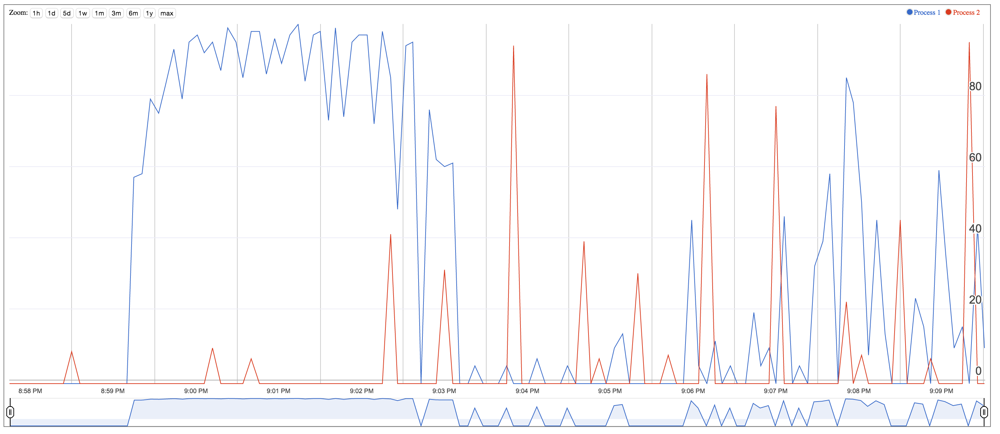
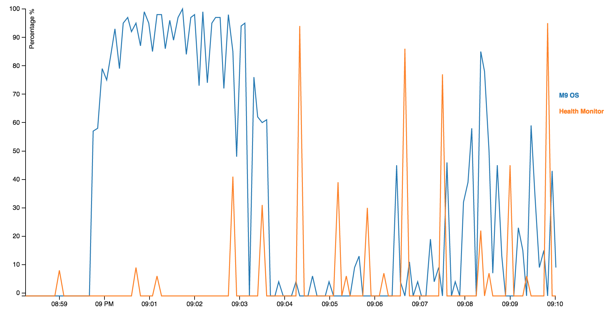

Put following files in web server to view them:
- **chart.html**: Chart using google annotation chart.
- 
- **cpu_chart_d3.html**: Simple Mulit-line chart using D3.js
- **top_data.tsv**: Data file used by *cpu_chart_d3.html*
- 
